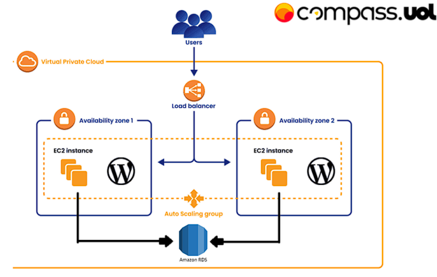

# Atividade de Wordpress e Docker na AWS CompassUOL
## **Resumo do Projeto**
Este projeto consiste no deploy de uma aplicação Wordpress utilizando serviços da AWS, incluindo:
- **Docker** para gerenciar os containers.
- **RDS** para o banco de dados MySQL.
- **EFS** para armazenamento de arquivos estáticos do Wordpress.
- **Load Balancer (CLB)** para distribuir o tráfego.
- **Auto Scaling Group** para escalabilidade automática.

---

## **Arquitetura do Projeto**



---

### 1️⃣ Criar uma VPC com 2 Subnets Públicas e Privadas
1. No **AWS Console**, acesse **VPC** e clique em **Criar VPC**.
2. Escolha a opção **VPC Only** e configure:
   - **Nome:** `MinhaVPC`
   - **CIDR Block:** `x.x.x.x/x`
   - **Ativar DNS Hostnames:** Sim
3. Clique em **Criar VPC**.

#### Criando Subnets
1. Ainda em **VPC**, vá para **Subnets** e clique em **Criar Subnet**.
2. Selecione a **VPC recém-criada**.
3. Crie **duas Subnets Públicas**:
   - **Nome:** `SubnetPublica-1`, **CIDR:** `x.x.x.x/x`, **AZ:** `us-east-1a`
   - **Nome:** `SubnetPublica-2`, **CIDR:** `x.x.x.x/x`, **AZ:** `us-east-1b`
4. Crie **duas Subnets Privadas**:
   - **Nome:** `SubnetPrivada-1`, **CIDR:** `x.x.x.x/x`, **AZ:** `us-east-1a`
   - **Nome:** `SubnetPrivada-2`, **CIDR:** `x.x.x.x/x`, **AZ:** `us-east-1b`

#### Crie um Internet Gateway
1. Vá para **Internet Gateways** e clique em **Criar IGW**.
2. Nomeie como `MeuIGW` e clique em **Criar**.
3. Associe o IGW à **MinhaVPC**.

#### Crie um NAT Gateway
1. Vá para **NAT Gateways** e clique em **Criar NAT Gateway**.
2. Escolha a **SubnetPublica-1**.
3. Aloque um **Elastic IP** e crie o NAT Gateway.
4. Repita o processo para a **SubnetPublica-2**.

#### Configurar Tabelas de Rotas
1. Vá para **Route Tables** e clique em **Criar Tabela de Rotas**.
2. Para **Subnets Públicas**:
   - Nome: `TabelaPublica`
   - Adicione a Rota: `0.0.0.0/0 → Internet Gateway (MeuIGW)`
3. Para **Subnets Privadas**:
   - Nome: `TabelaPrivada`
   - Adicione a Rota: `0.0.0.0/0 → NAT Gateway`

Dessa forma, suas instâncias privadas terão acesso à internet.

---

### 2️⃣ Criar um Banco de Dados RDS MySQL
1. Vá para **RDS** > **Databases** e clique em **Criar Banco de Dados**.
2. Escolha **Standard Create** e o **Motor MySQL**.
3. Configure:
   - **Nome da Instância:** `WordPressDB`
   - **Versão:** `MySQL 8.x`
   - **Usuário Admin:** `admin`
   - **Senha:** sua senha
   - **Classe da Instância:** `db.t3.micro`
   - **Storage:** 20GB
   - **VPC:** `MinhaVPC`
   - **Subnets:** Selecione as **Subnets Privadas**
4. Desative o acesso público e clique em **Criar**.

---

### 3️⃣ Criar um Volume EFS
1. Vá para **EFS** e clique em **Criar Sistema de Arquivos**.
2. Nomeie como `MeuEFS`.
3. Selecione a **VPC `MinhaVPC`** e configure o **Mount Target** para cada **Subnet Privada**.
4. Clique em **Criar**.

---

### 4️⃣ Criar uma Instância EC2 com Docker e EFS
1. Vá para **EC2 > Instâncias** e clique em **Launch Instance**.
2. Escolha **Amazon Linux 2** ou **Ubuntu**.
3. Defina:
   - **Nome:** `MinhaInstancia`
   - **Tipo:** `t3.medium`
   - **VPC:** `MinhaVPC`
   - **Subnet:** `SubnetPrivada-1`
   - **Security Group:** Permitir **porta 22 (SSH)**, **2049 (EFS)**, **80 (HTTP)** e **3306 (MySQL)**
   - **User Data:** Preencha o campo User Data com o seguinte código:
```
#!/bin/bash
yum update -y
amazon-linux-extras enable docker
yum install -y docker
service docker start
usermod -a -G docker ec2-user
sudo curl -L https://github.com/docker/compose/releases/latest/download/docker-compose-$(uname -s)-$(uname -m) -o /usr/local/bin/docker-compose
sudo chmod +x /usr/local/bin/docker-compose
systemctl enable Docker
yum -y install amazon-efs-utils
sudo mount -t nfs4 -o nfsvers=4.1,rsize=1048576,wsize=1048576,hard,timeo=600,retrans=2,noresvport {ID do seu EFS}.efs.us-east-1.amazonaws.com:/ efs
```
4. Clique em **Launch**.

---

### 5️⃣ Criar e Executar o Docker-Compose
1. Acesse a instância via SSH e crie o diretório `/efs`.
2. Monte o volume EFS.
3. No `/efs`, crie um `docker-compose.yml` com a imagem do WordPress.
```yaml
version: '3.7'

services:
  wordpress:
    image: wordpress:latest
    container_name: wordpress
    ports:
      - "80:80"
    environment:
      WORDPRESS_DB_HOST: <RDS_ENDPOINT>
      WORDPRESS_DB_USER: <DB_USER>
      WORDPRESS_DB_PASSWORD: <DB_PASSWORD>
      WORDPRESS_DB_NAME: wordpress
    volumes:
      - wordpress_data:/var/www/html
```
4. Execute `docker-compose up -d` para iniciar os containers.

---

### 6️⃣ Criar um Auto Scaling Group
1. Vá para **EC2 > Auto Scaling Groups**.
2. Clique em **Create Auto Scaling Group**.
3. Escolha:
   - **Launch Template:** Crie um Launch template com os mesmo dados da instância EC2 criada anteriormente, com o seguinte user data:
```
#!/bin/bash
yum update -y
amazon-linux-extras enable docker
yum install -y docker
service docker start
usermod -a -G docker ec2-user
sudo curl -L https://github.com/docker/compose/releases/latest/download/docker-compose-$(uname -s)-$(uname -m) -o /usr/local/bin/docker-compose
sudo chmod +x /usr/local/bin/docker-compose
systemctl enable Docker
cd /
mkdir efs
sudo mount -t nfs4 -o nfsvers=4.1,rsize=1048576,wsize=1048576,hard,timeo=600,retrans=2,noresvport {ID do seu EFS}.efs.us-east-1.amazonaws.com:/ efs
cd efs
docker-compose up
```
   - **VPC:** `MinhaVPC`
   - **Subnets:** Selecione as **Subnets Privadas**
   - **Mínimo:** `2`, **Máximo:** `3`
4. Configure a política de escalonamento baseada na CPU (`75%`).
5. Clique em **Create**.

---

### 7️⃣ Criar um Load Balancer
1. Vá para **EC2 > Load Balancers**.
2. Clique em **Create Load Balancer** e escolha **Application Load Balancer**.
3. Defina:
   - **Nome:** `WordPressALB`
   - **VPC:** `MinhaVPC`
   - **Subnets:** Selecione as **Subnets Públicas**
   - **Security Group:** Permita tráfego nas portas **80 e 443**
4. Crie um **Target Group** e associe o Auto Scaling Group.
5. Finalize a criação.

---
